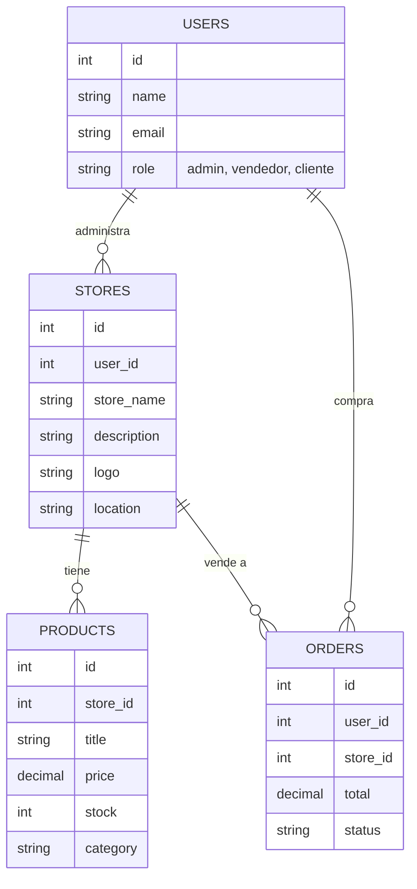

# Plan Maestro: Marketplace CALEB con Laravel 12 y Vue 3

¡Excelente elección! **Laravel** es hoy en día uno de los frameworks más potentes, seguros y maduros del mercado. Al combinarlo con **Vue 3** usando **Inertia.js**, obtienes lo mejor de dos mundos: la solidez de PHP en el servidor y la fluidez de una aplicación moderna en el navegador, sin la complejidad de crear una API separada.

A continuación, presento el plan estratégico adaptado a esta tecnología. Puedes guardar esta página en tu navegador como PDF (usando la opción Imprimir -> Guardar como PDF).

---

## 1. El Nuevo Stack Tecnológico (La Pila)

*   **Backend & Servidor:** PHP + Laravel 12. Se encargará de la lógica de negocio, seguridad, base de datos y enrutamiento.
*   **Base de Datos:** MySQL / MariaDB (Incluido en tu Laragon).
*   **Frontend:** Vue 3 (Conservamos lo que ya tienes construido).
*   **El Puente (El pegamento):** Inertia.js. Es una librería que permite a Laravel enviar datos directamente a las páginas de Vue 3, eliminando la necesidad de programar una API tradicional.
*   **Autenticación:** Laravel Breeze o Jetstream (Nos dará el login, registro y gestión de sesiones casi listo desde el primer día).

---

## 2. Arquitectura de la Aplicación

```mermaid
flowchart LR
    A[Navegador (Usuario)] -->|1. Petición Web| B(Laravel 12 - Enrutador)
    B --> C{Controlador Laravel}
    C -->|2. Consulta datos| D[(MariaDB / MySQL)]
    D -->|3. Devuelve datos| C
    C -->|4. Envía datos por Inertia| E[Componente Vue 3]
    E -->|5. Renderiza Vista| A
```

## 3. Modelo de Datos Relacional (MariaDB)

Para el sistema multivendedor, la base de datos se estructurará así:



---

## 4. Hoja de Ruta (Plan de Ejecución)

### Fase 1: Cimientos y Migración (Semana 1)
No tiraremos tu trabajo. Lo primero será inicializar Laravel y mudar tu actual código de Vue hacia la estructura de Laravel.
*   Crear proyecto Laravel 12.
*   Instalar Inertia.js y Vue 3 dentro de Laravel.
*   Migrar tu actual interfaz (CSS, componentes Vue, Vite config) a la carpeta `resources/js` de Laravel.
*   Verificar que la vista principal (que me mostraste) funcione ahora bajo Laravel.

### Fase 2: Base de Datos y Roles (Semana 2)
*   Crear las "Migraciones" en Laravel (código que crea las tablas en MariaDB).
*   Instalar **Laravel Breeze** para habilitar que las personas se registren e inicien sesión.
*   Configurar los permisos: Un usuario se registra como "Cliente" pero puede solicitar ser "Emprendedor".

### Fase 3: El Panel del Emprendedor (Semana 3)
*   Desarrollar un "Dashboard" privado para los vendedores.
*   Formulario para crear/editar el perfil de su **Tienda** (Logo, Nombre, Ubicación).
*   Formulario (CRUD) para que el emprendedor pueda **agregar, editar y eliminar sus productos o servicios**.
*   Las imágenes se guardarán de forma segura en el almacenamiento de Laravel.

### Fase 4: El Marketplace Público (Semana 4)
*   Modificar la tienda actual para que los productos vengan desde la base de datos MariaDB.
*   Añadir la etiqueta o nombre del negocio en cada tarjeta de producto.
*   Crear la página individual de cada negocio (ej. `caleb.com/tienda/riko-pollo`).
*   Implementar el buscador territorial (Filtrar por municipio/departamento).

### Fase 5: Carrito y Pedidos (Semana 5)
*   Lógica para que al "Comprar", se genere un pedido en la base de datos y le llegue la notificación al vendedor.

---

## 5. Ejemplos Prácticos de cómo será el Código

Para que veas lo limpio que es este método, aquí tienes un ejemplo de cómo interactúa Laravel con tu Vue actual:

**1. El Controlador en Laravel (PHP)**
*En lugar de retornar una vista HTML, Laravel retorna un componente Vue y le pasa la lista de productos de la base de datos.*

```php
<?php
namespace App\Http\Controllers;
use Inertia\Inertia;
use App\Models\Product;

class MarketplaceController extends Controller
{
    public function index()
    {
        // Traemos todos los productos desde MariaDB, incluyendo la tienda que lo vende
        $productos = Product::with('store')->get();

        // Enviamos los datos directamente al componente de Vue 3
        return Inertia::render('Home/Marketplace', [
            'productos' => $productos
        ]);
    }
}
```

**2. El Componente en Vue 3 (Javascript)**
*Tu código de Vue recibe los datos como propiedades (props), sin necesidad de usar `fetch` o `axios`.*

```vue
<template>
  <div class="grid">
    <!-- Recorremos los productos que mandó Laravel -->
    <ProductCard 
       v-for="producto in productos" 
       :key="producto.id" 
       :data="producto" 
    />
  </div>
</template>

<script setup>
// Aquí recibimos la variable 'productos' que nos envió Laravel desde PHP
defineProps({
  productos: Array
});
</script>
```

---

## Conclusión

El paso a **Laravel + Inertia + Vue 3** es una decisión arquitectónica "Enterprise". Te permitirá tener la base de datos organizada en MariaDB y tener un panel de control administrativo seguro con PHP, mientras los usuarios disfrutan de una interfaz rápida e interactiva con Vue 3.

**¿Qué sigue?**
Tómate el tiempo de leer este plan, exportarlo o imprimirlo (Ctrl+P en tu navegador y "Guardar como PDF"). Si estás de acuerdo, el primer paso que daremos (cuando me lo indiques) será **crear el proyecto base de Laravel e instalar Inertia**, para luego trasladar tu código de Vue actual hacia allá.
